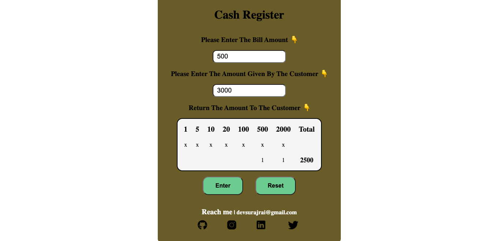

# Cash Register Manager

This is a simple app to ease up the cash exchange. Cashier takes the cash from the customer and enters the bill amout and cash received after that the app tells the cashier the amount to return in as less notes as possible.
#### This app is a CLI App as well as a WEB APP

#### Try it live(CLI): [Click Here](https://replit.com/@SurajRai4/cashRegisterManager?embed=1&output=1)

#### Try it live(WEB): [Click Here](https://cash-register-manager-01.netlify.app)

### Screenshot 👇

